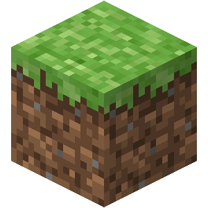

<h1 align="center">Greetings! I'm Kevin.</h1>
<h3 align="center">I'm a college student at Rochester Institute of Technology working towards a degree in computer science, a minor in cybersecurity, and an immersion in geographic information systems.</h3>
<h3 align="center">My Website: https://kwu1010.github.io<\h3>

<h3 align="left">Languages and Tools:</h3>

 
    <!------>
     
    <!------>
     
    <!------>
     
    <!------>
     
    <!------>
     
    <!------>
     
    <!------>
    
    <!------>
    
    <!------>
    
    <!------>

